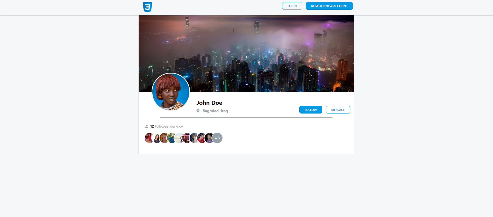

# Twitter clone code along

This code along is designed to help you practice writing CSS for a full page. Take a look at the design linked to below and make sure that write the HTML & CSS code for it **without** using FlexBox or CSS Grid. Good luck!

